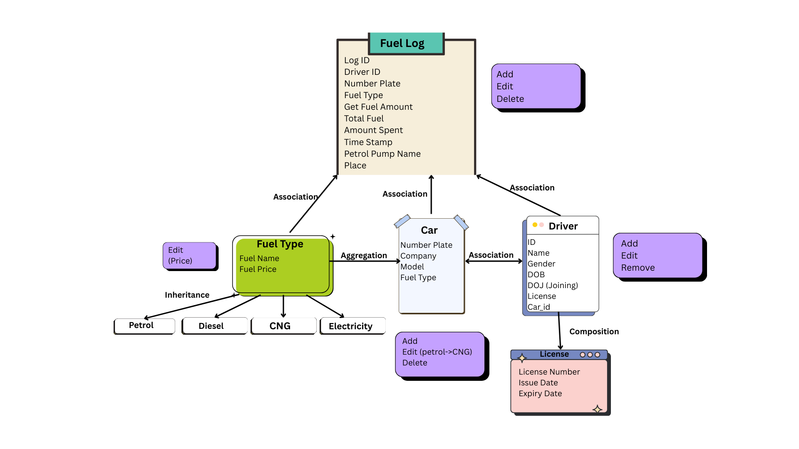

# FUELCO - Fuel Management System

FUELCO is a fuel-management tool that enables efficient tracking of fuel usage for a fleet of cars. It manages fuel entries for vehicles and drivers to support monitoring, reporting, and optimization of fuel consumption.

---

## Benefits

FUELCO can be beneficial for:

- Institutions  
- Car rental services  
- Hospitals  
- Transportation services  
- Courier services  
- Delivery services  
- Any organization using multiple vehicles  

It helps these organizations efficiently track fuel usage, generate reports, and optimize fuel consumption.

---

## Future Advancements

- Expand FUELCO to manage all kinds of expenses within an institution.  
- Integrate with Google Maps to track vehicle location, speed, and estimated arrival time.  
- Implement in-vehicle systems to receive live data including fuel level, mileage, speed, tire pressure, and camera feeds.  

---

## Architecture & Design Principles

FUELCO follows **SOLID design principles**:

- **SRP (Single Responsibility Principle):** Every class has only one responsibility.  
- **OCP (Open/Closed Principle):** System can be extended without modifying existing structures.  
- **LSP (Liskov Substitution Principle):** Subclass objects can replace superclass objects without modification.  
- **ISP (Interface Segregation Principle):** Clients are not forced to depend on methods they do not use.  
- **DIP (Dependency Inversion Principle):** High-level modules and low-level modules depend on abstractions, not directly on each other.  
  - Example: Low-level `database.py`, High-level `FastAPI` implementation.

---

## Design Patterns

- **Active Record Design Pattern:**  
  Classes represent database tables, and object properties correspond to table columns. Includes methods for `insert`, `update`, `delete`, etc.  

- **Creational Patterns:**  
  Focuses on flexible object creation, separating creation logic from application logic.  
  - *Factory Method:* Allows client code to create objects without knowing the details of the process.  

- **Behavioral Patterns:**  
  Distributes responsibilities among objects and defines their interactions.

---

## Architecture Diagram

*Diagram illustrating the system architecture.*

---

## Author

Deepanshi6  
[GitHub Profile](https://github.com/Deepanshi6)
